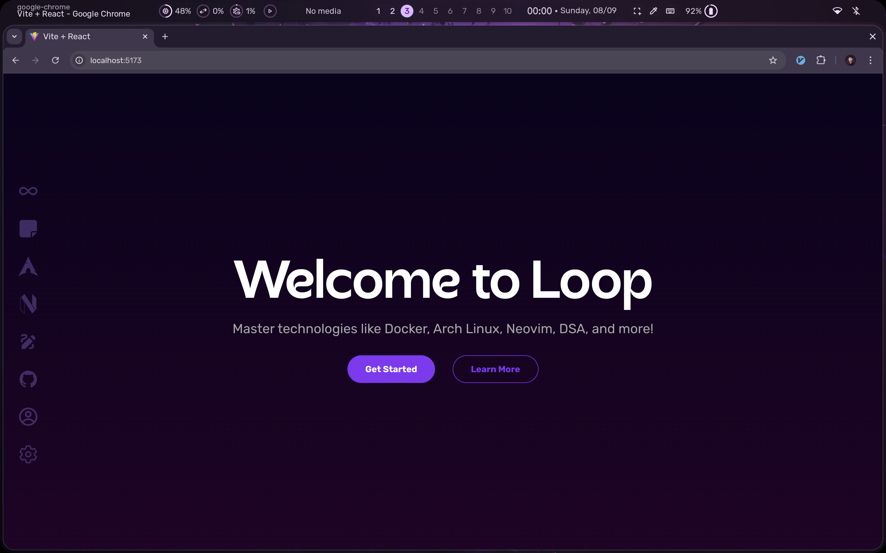

# Loop

**Loop** is a web application designed to help users learn and master various technologies such as Docker, Arch Linux, Neovim, DSA, and more. The platform provides a collection of problems and solutions to facilitate continuous learning, offering a user-friendly interface and a visually appealing design.

## Features

- Learn topics such as:
  - Docker
  - Arch Linux
  - Neovim
  - Data Structures and Algorithms (DSA)
  - Web Development
  - Problem Solving
- Professional design with a violet color palette
- Fixed sidebar with smooth animations and hover effects
- Login and registration system
- User profile page to track learning progress
- Topics presented with big shapes and circles for creative section layout


## Screenshots



## Tech Stack

- **Frontend**: React, Tailwind CSS, Framer Motion
- **Backend**: Node.js, Express.js
- **Database**: MongoDB
- **Authentication**: JWT (JSON Web Tokens)

## Installation

To get a local copy up and running, follow these steps:

### Prerequisites

- Node.js installed
- MongoDB running locally or via cloud (e.g., MongoDB Atlas)

### Installation Steps

1. Clone the repository:

    ```bash
    git clone https://github.com/yourusername/loop.git
    ```

2. Navigate to the project directory:

    ```bash
    cd loop
    ```

3. Install the dependencies for both frontend and backend:

    ```bash
    # For backend
    cd server
    npm install

    # For frontend
    cd ../client
    npm install
    ```

4. Create a `.env` file in the `server` folder with the following variables:

    ```bash
    MONGO_URI=your_mongo_db_uri
    JWT_SECRET=your_jwt_secret
    ```

5. Start the development server:

    ```bash
    # Start backend
    cd server
    npm run dev

    # Start frontend
    cd ../client
    npm start
    ```

6. Access the website at `http://localhost:3000`.

## Contributing

Feel free to contribute to **Loop** by submitting issues or pull requests. Contributions are welcome and appreciated!

## License

This project is licensed under the MIT License.

